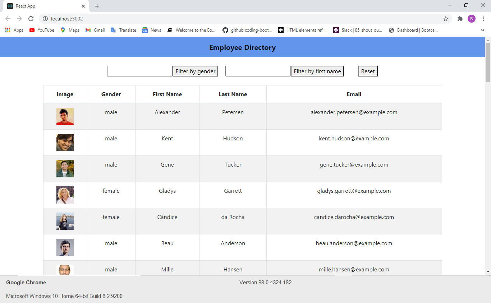

# Employee-Directory-React

## Title:
Employee Directory

Link for the deployed site: 

## Description
This is a React Employee Directory App that allow the user to view their entire employee directory at once so that the user have quick access to the employee information.  The user will be able to filter by gender and first name, as well as the ability to sort employee by email, first, and last name in ascending order.
 
 
The following GIF demonstrates the application functionality:

## Installation
No installation needed.  Only click on the following Herohu link:

## Table of Contents
  * [Installation](#installation)
  * [Questions](#questions)
  * [License](#license)

## License
MIT license

## Questions
The following is my Github account:
[decoste](https://github.com/decoste)

Please feel free to send me an email if you have any question(s) aladecoste@gmail.com

Screenshot of the website:

